# image-text-translation-extraction-pipeline

## Description

In this example we will simulate a real-world cloud-native image processing pipeline. Upon uploading an image to a designated Google Cloud Storage (GCS) bucket, a serverless Google Cloud Function (GCF) is automatically triggered. This Cloud Function then uses the Google Cloud Vision API to extract text from the uploaded image. Once this text extraction operation is complete, the results are dispatched to a Google Cloud Pub/Sub topic, serving as a communication conduit in our event-driven architecture. Subsequently, another Cloud Function is activated by these Pub/Sub messages. This second function engages the Google Cloud Translate API, converting the extracted text into a different language.Upon successful translation, the results are channeled to a second Pub/Sub topic. This second topic then triggers a third Cloud Function. The role of this final function in our pipeline is to take the translated text and securely store it in a separate GCS bucket.

Through this example, we'll build an automated, serverless pipeline using various Google Cloud services and APIs, using Javascript (NodeJS).

### Flowchart visualizing the steps

```mermaid
flowchart LR
  CB[Cloud Bucket Upload] --triggers--> CF1[Cloud Function Vision API]
  CF1 --stores results--> PT1[PubSub Topic Text from Vision API]
  PT1 --triggers--> CF2[Cloud Function Translate API]
  CF2 --stores results--> PT2[PubSub Topic Translated Text]
  PT2 --triggers--> CF3[Cloud Function Store Result]
  CF3 --stores results--> CB2[Cloud Bucket Translated Text]
```

## GCP Resources

In this example, we'll employ several Google Cloud resources to build an end-to-end serverless image processing pipeline. The following elements will constitute our architecture:

- An initial Google Cloud Storage (GCS) bucket for image upload: This will serve as the point of entry for the images containing the text to be processed.
- A second GCS bucket dedicated to storing the translated text results: The final output of our pipeline will be deposited here.
- A Google Cloud Pub/Sub topic to facilitate the flow of extracted text: This topic will be employed to transport the textual content that's been extracted from the uploaded images using the Cloud Vision API.
- Another Pub/Sub topic for conveying the translated text: This will carry the translated text, courtesy of the Cloud Translate API, to the final Cloud Function.
- The first Google Cloud Function will be triggered by the image upload into the initial GCS bucket: It will make calls to the Cloud Vision API for text extraction from the uploaded images.
- The second Cloud Function will spring into action when messages arrive at the first Pub/Sub topic: It's responsible for taking the extracted text and invoking the Cloud Translate API for translation.
- The third and final Cloud Function will be activated upon the arrival of messages at the second Pub/Sub topic: Its role is to take the translated text and store it into the final GCS bucket.

## Challenges

1) Setup everything manually through the console
2) Setup everything using Terraform (main.tf skeleton is provided)

## Testing the solution

Upload an image with some text to your cloud bucket. This action should trigger the pipeline and produce a text file in the output bucket with the translated text.

## Notes

All the needed source code is available in the `cloud-functions` folder. When creating the cloud functions don't forget to setup the appropriate environment variables (check the code for names).
In case you get stuck you can check the already deployed cloud functions, buckets and pubsub topics to better understand how they are connected together. In case of any problems or questions please refer to our Slack channel and we'll discuss and try to solve it together.